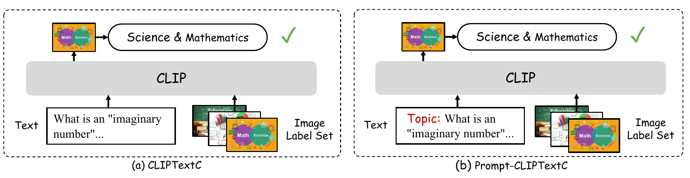
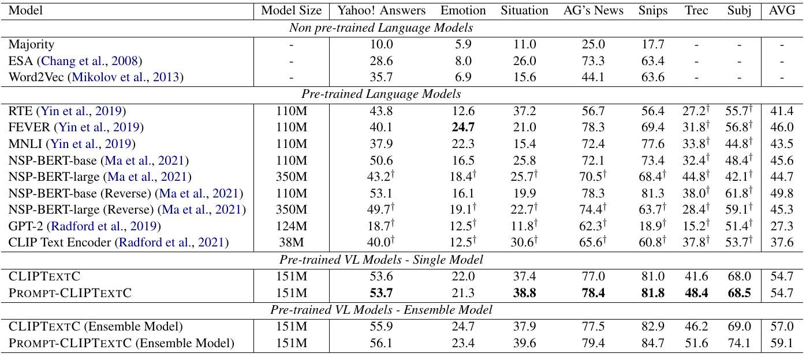

<!--
 * @Author: Qiguang Chen
 * @LastEditors: Qiguang Chen
 * @Date: 2023-05-09 10:38:42
 * @LastEditTime: 2023-05-11 17:26:31
 * @Description: 
 * 
-->
# CLIPText: A New Paradigm for  Zero-shot Text Classification

 [](https://opensource.org/licenses/MIT) 

This repository contains the PyTorch implementation and the data of the paper: **CLIPText: A New Paradigm for  Zero-shot Text Classification**. **[Libo Qin](https://scholar.google.com/citations?user=8lVpK1QAAAAJ)**, [Weiyun Wang](https://scholar.google.com/citations?hl=zh-CN&user=GJYzDkYAAAAJ), [Qiguang Chen](https://lightchen233.github.io/), [Wanxiang Che](http://ir.hit.edu.cn/~car/).  ***ACL2023 Findings***.[[PDF]]() .


<div>

</div>


This code has been written using PyTorch >= 2.0. If you find this code useful for your research, please consider citing the following paper:

<pre>
@misc{xxx,
      title={CLIPText: A New Paradigm for  Zero-shot Text Classification}, 
      author={Libo Qin and Weiyun Wang and Qiguang Chen and Wanxiang Che},
      year={2023},
      eprint={xxx},
      archivePrefix={arXiv},
      primaryClass={cs.CL}
}
</pre>


## Network Architecture




## Prerequisites

This codebase was developed and tested with the following settings:

```
-- scikit-learn==1.2.1
-- numpy==1.24.2
-- pytorch==2.0.1
-- torchvision==0.15.2
-- tqdm==4.64.1
-- clip==1.0
-- transformers==4.27.1
-- regex==2022.10.31
-- ftfy==6.1.1
-- pillow==9.4.0
```

* Please Attention: Different version of clip might lead to different results, we hope that you can install clip by this command:

```shell
pip install git+https://github.com/openai/CLIP.git@a9b1bf5
```

## How to run it

The script **main.py** acts as a main function to the project, you can run the experiments by the following commands:

* To replicate our `CLIPTextC` results on the test set:

```shell
python main.py --test --dataset [dataset_name]
```

* To replicate our `Prompt-CLIPTextC` results on the test set:

```
python main.py --test --text_prompt --dataset [dataset_name]
```

* To replicate our `ensemble` results on the test set:

```
python main.py --test [--text_prompt] --ensemble_size 2 --dataset [dataset_name]
```

where  `[dataset_name]` in `['emotion', 'situation', 'topic', 'agnews', 'snips', 'trec', 'subj']`

## Model Performance

<div>

</div>

